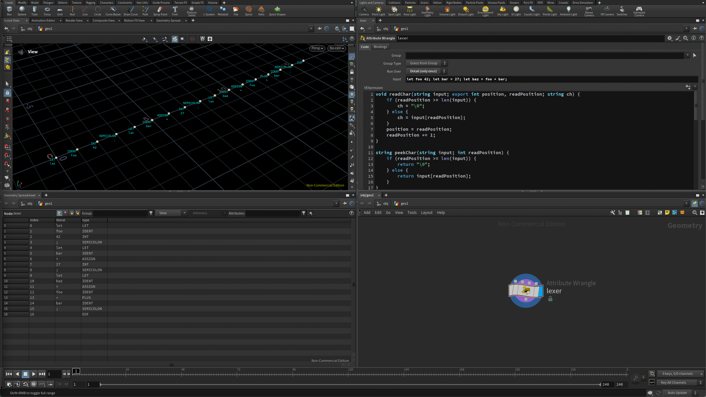

# Writing an Interpreter in VEX

> “VEX is a high-performance expression language used in many places in Houdini, such as writing shaders.”  
> — [SideFX VEX Documentation](https://www.sidefx.com/docs/houdini/vex/index.html)

VEX code is typically written inside *Wrangle* nodes, such as **Point Wrangles** or **Detail Wrangles**.

A **Detail Wrangle** executes exactly once, while a **Point Wrangle** runs once per point in the input geometry.

Because VEX doesn’t support structs to represent tokens or manage lexer state, I use a string format of the form `<TYPE>_<LITERAL>` to encode each token.

This allows me to split the string by the underscore (`_`) and create one point per token, assigning attributes such as `s@type` and `s@literal`.

To test the lexer, I append a second **Point Wrangle** that compares the `type` and `literal` attributes against expected values.



The source code for the interpreter can be provided in a couple of ways.

### 1. From a channel parameter

```c
...

string input = chs("input");
int position = 0;
...
```

This creates a string parameter on the wrangle that you can type code into directly.

### 2. From an incoming string attribute

```c
...

string input = s@input;
int position = 0;
...
```

This approach assumes the incoming geometry stream has a detail attribute named s@input containing the source code.

